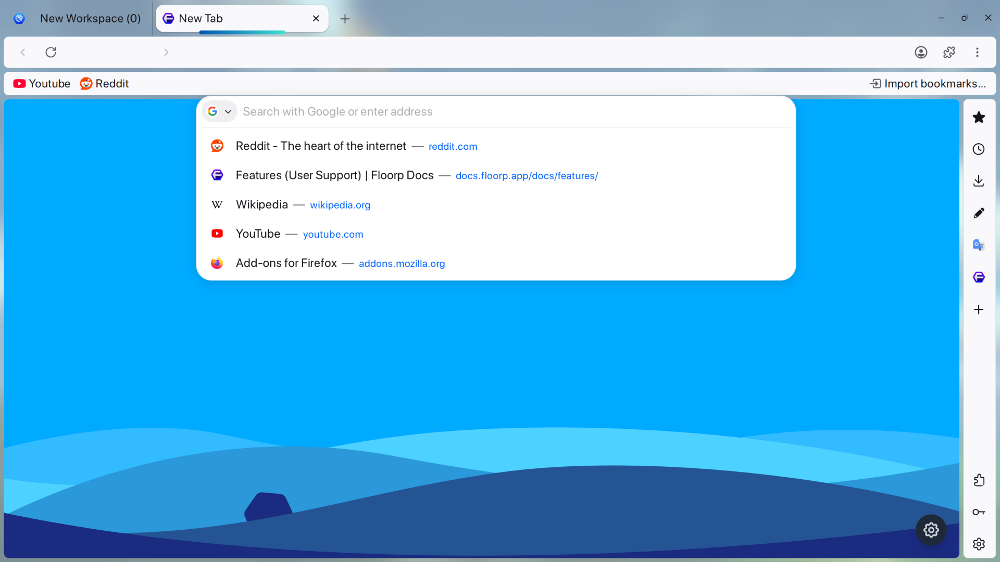

<h1 align="center">Float Floorp</h1>

Make your Floorp float~

 

This is my personal CSS for Floorp.

## License
[Natsumi](https://github.com/greeeen-dev/natsumi-browser):  GPL-3.0 
[Lucide Icons](https://lucide.dev/): MIT
